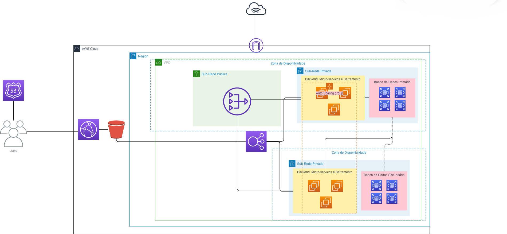

# Arquitetura Corporativa

## Diagrama

## Componentes
- Route 53: Funciona como um sistema de DNS avançado, que não apenas traduz nomes de domínio em endereços IP, mas também otimiza e gerencia as rotas de acesso dos usuários aos recursos da AWS, garantindo eficiência e resiliência.
- CloudFront: Esta CDN acelera a entrega de conteúdo, como arquivos estáticos ou conteúdo dinâmico, para os usuários finais, reduzindo a latência através de uma vasta rede global de pontos de presença (PoPs).
- S3 (Simple Storage Service): Oferece um armazenamento de objetos seguro, durável e de alta escala. Ideal para uma vasta gama de aplicações, o S3 garante a disponibilidade e proteção dos dados.
- ELB (Elastic Load Balancer): Distribui automaticamente o tráfego de entrada entre múltiplos alvos – como instâncias EC2 – em múltiplas zonas de disponibilidade, assegurando alta disponibilidade e escalabilidade sem comprometer o desempenho.
- EC2 (Elastic Compute Cloud): Proporciona capacidade computacional ajustável na nuvem. Permite escalar para cima ou para baixo com facilidade, de acordo com as demandas, e oferece uma ampla seleção de tipos de instâncias.
- Nat Gateway: Permite que instâncias em sub-redes privadas se conectem a serviços externos ou à internet, garantindo que o tráfego de internet entrante não atinja diretamente essas instâncias.
- Internet Gateway: Fornece um ponto de acesso vital para instâncias EC2 se conectarem à internet, permitindo comunicações bidirecionais entre instâncias e o mundo exterior.
- RDS (Relational Database Service): Facilita o setup, a operação e a escala de bancos de dados relacionais na nuvem, oferecendo capacidades de gerenciamento automatizado, backups e replicação para alta disponibilidade.

## Conexões dos componentes
Ao acessar a aplicação, o processo inicia com o Route 53, que desempenha um papel crucial ao direcionar as solicitações dos usuários para o endpoint mais eficiente, garantindo uma resposta rápida e confiável. A partir daí, o CloudFront entra em ação, servindo conteúdo estático do frontend, a partir do S3, otimizando a entrega com sua rede global de distribuição para reduzir a latência. Para conteúdo dinâmico e interações que exigem processamento, as solicitações são encaminhadas para o ELB. Este componente é fundamental para distribuir o tráfego de forma equitativa entre as instâncias EC2, adaptando-se às variações de carga ao adicionar ou remover instâncias conforme necessário. Essa elasticidade assegura que a aplicação possa lidar com picos de tráfego sem comprometer o desempenho ou a disponibilidade.

Dentro da rede AWS, o Nat Gateway e o Internet Gateway são componentes essenciais para a comunicação externa das instâncias EC2. O Nat Gateway permite que instâncias em sub-redes privadas se conectem a recursos externos para atualizações ou serviços, mantendo a rede interna protegida. Já o Internet Gateway oferece um caminho para que essas instâncias se comuniquem com a internet, permitindo a troca de dados com o mundo exterior de maneira segura. O backend da aplicação, hospedado nas instâncias EC2, interage com o RDS para operações de banco de dados. O RDS é configurado para alta disponibilidade, com instâncias de banco de dados espelhadas em múltiplas zonas de disponibilidade, garantindo que, mesmo no caso de falhas, os dados permaneçam acessíveis e a aplicação continue operando sem interrupções significativas, assegurando uma experiência de usuário consistente e confiável.
