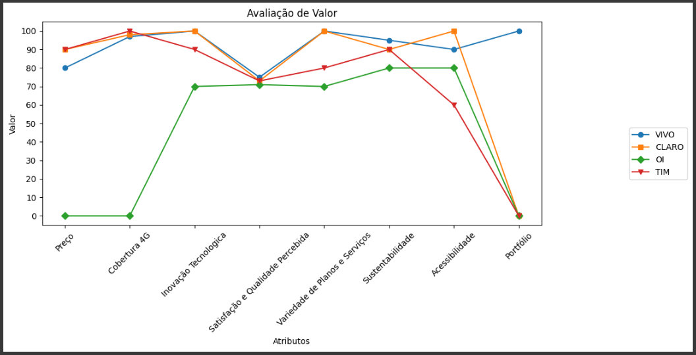
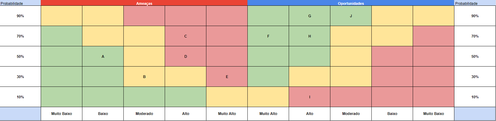
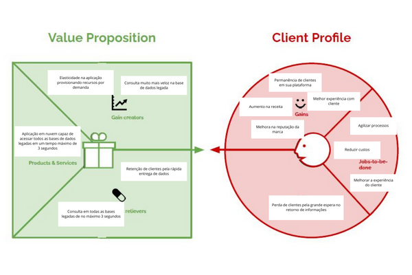

# **Entendimento do Negócio**

# Matriz de Oceano Azul

A Matriz de Oceano Azul é uma ferramenta estratégica que auxilia empresas a navegar em mercados inexplorados, buscando oportunidades de crescimento rentável. Este estudo aplica a Matriz à Vivo, avaliando seu portfólio e comparando-a com seus principais concorrentes: Claro, TIM e Oi.

**Reduzir:**

Nessa ação, a ideia é reduzir ou simplificar características presentes em produtos ou serviços tradicionais, tendo em vista que a mudança não impacta negativamente o usuário.

**Aumentar:**

Nessa ação, o foco está em ampliar os atributos que são valorizados pelos clientes, visando proporcionar maior valor e eficiência do que os concorrentes oferecem aos usuários finais.

**Criar:**

Essa ação envolve a criação de um atributo. Ou seja, seria o diferencial da solução em relação aos demais concorrentes.

**Eliminar:**

Nessa ação, a estratégia envolve a remoção de atributos que a concorrência pode considerar essenciais, mas que, na realidade, não afetam significativamente o valor percebido pelo cliente.

**Matriz de Avaliação de Valor**

Para realizar a avaliação de valor foi pesquisado empresas concorrentes que tivessem alguma semelhança com a solução criada.

Dentre elas estão:

**Vivo**

A Vivo foi fundada em 2003 por meio de uma joint venture entre a Portugal Telecom e a Telefónica (Espanha). Entretanto, em 2010, foi adquirida 100% pela Telefónica, tornando-se parte do Grupo Telefónica. Atualmente, a empresa está em segundo lugar em número de assinantes de banda larga. Ela oferece diversos serviços relacionados à comunicação, desde telefonia móvel e fixa até televisão por assinatura, serviços de nuvem (B2B), marketplace e serviços de streaming. Além disso, a Vivo atua também na área da saúde e educação por meio de seus aplicativos e projetos paralelos, como Vivo Educa e Vivo Saúde. Vale ressaltar que a Vivo atende mais de 100 milhões de clientes na América Latina.

**Claro**

A Claro é uma das principais empresas de telecomunicações do Brasil. Fundada em 2003 no Brasil, mas pertencente ao grupo mexicano América Móvil. Atualmente, a Claro emprega mais de 100 mil funcionários, disponibilizando uma ampla variedade de serviços de comunicação, incluindo telefonia móvel, fixa, internet e televisão por assinatura para mais de 100 milhões de clientes na America Latina. É importante destacar que a Claro é a operadora com o maior número de assinantes de banda larga em todo o país.

**Oi**

A Oi, anteriormente Telemar, foi fundada em 1998 no Rio de Janeiro. A empresa passou a ser chamada de Oi apenas em 2003, sendo uma das pioneiras em oferecer serviços convergentes de banda larga, TV por assinatura e transmissão de voz local e de longa distância. Atualmente, a companhia é a operadora com maior capilaridade de rede de fibra, totalizando 400 mil quilômetros. Além disso, é a quarta maior em número de assinantes no setor de telecomunicação.

**TIM**

A TIM Brasil é uma empresa do grupo TIM, a maior empresa de telecomunicações da Itália, fundada em 1995, porém iniciou suas operações em 1998. Foi pioneira na tecnologia 3G, sendo a primeira operadora a oferecer esse serviço no Brasil. Além disso, a empresa expandiu sua cobertura de telefonia e internet móvel por todo o Brasil, tornando-se a terceira maior empresa de telefonia no território brasileiro.

Com base nessas empresas, criou-se uma tabela com os valores de cada atributo dependendo da empresa. Em seguida, construiu-se um gráfico para que seja possível visualizar as diferenças entre os concorrentes em determinados atributos/características.

**Tabela da Avaliação de Valor.**

**Gráfico:**

#### Atributos:

**Análise de Concorrentes**

A análise de concorrentes foi realizada considerando os seguintes atributos:

- **Cobertura 4G:** A Vivo se destaca com a segunda maior cobertura, atrás da TIM.
- **Portfólio:** A Vivo se diferencia por oferecer um portfólio diversificado, com serviços de saúde, educação, finanças, marketplace, entretenimento e casa inteligente.
- **Inovação Tecnológica:** A Vivo investe em infraestrutura de rede, fibra óptica, 5G e IoT, mas a Claro e a TIM também apresentam investimentos significativos.
- **Satisfação e Qualidade Percebida:** A Vivo se destaca com a segunda maior pontuação na pesquisa da ANATEL, atrás da Claro.
- **Variedade de Planos e Serviços:** A Vivo e a Claro empatam com a maior variedade, seguidas pela TIM e Oi.
- **Preço:** A Vivo apresenta preços competitivos, mas a TIM e a Claro oferecem mais gigabytes por um preço similar.
- **Acessibilidade:** A Vivo ocupa o segundo lugar no ranking da ANATEL, atrás da Claro.
- **Sustentabilidade:** A Vivo se destaca com reconhecimentos e práticas ESG, mas a Claro e a TIM também apresentam iniciativas relevantes.

##### **Reduzir:**

**Preço:** Ao selecionar os valores na tabela, consideramos os preços dos planos pré-pagos de cada operadora. Observamos que os valores seguem uma linha bastante semelhante, em torno de R$ 30. No entanto, tanto a TIM quanto a Claro oferecem uma quantidade maior de gigabytes de internet por 30 dias, além de serviços adicionais como WhatsApp ilimitado e acesso a plataformas de vídeo que não consomem os dados móveis contratados. Por isso, receberam uma nota de 90. Por outro lado, a Vivo oferece a mesma quantidade de GB, mas apenas com o benefício de minutos ilimitados, o que resultou em uma nota de 80. Atualmente, a Oi não opera mais na área de pré-pagos para dispositivos móveis, portanto, recebeu uma nota 0. Dessa forma, a Vivo tem espaço para oferecer um produto com preço menor do que seus concorrentes, já que o valor agregado de seu produto é um pouco inferior. Essa redução de preço aumentará o valor agregado para o cliente em relação ao serviço.

##### **Aumentar:**

**Cobertura 4G**: Ao determinar o valor deste indicador, considerou-se a percentagem (%) da população brasileira abrangida pela rede de cada operadora. No caso da TIM, que abrange 100% de todas as cidades do Brasil com sua tecnologia 4G, foi atribuída a pontuação máxima de 100. A Claro cobre aproximadamente 4800 municípios brasileiros, o que representa 98% da população dentro de sua área de cobertura 4G, enquanto a Vivo alcança mais de 3200 cidades, atingindo cerca de 97% de toda a população do país. Entretanto, no caso da Oi, a falta de informação concreta sobre o número de cidades ou a porcentagem da população coberta por sua rede 4G resultou na atribuição do valor 0. Assim, é evidente que expandir a cobertura de rede da Vivo é crucial para assegurar que um contingente ainda maior de pessoas tenha acesso aos seus serviços, consolidando sua posição competitiva no mercado de telecomunicações.

**Inovação Tecnologica**: Para avaliar o desempenho de cada operadora no atributo Tecnologia e Inovação, considerou-se os investimentos em infraestrutura de rede, parcerias estratégicas, adoção de novas tecnologias e iniciativas de transformação digital. A Claro se destaca por seus significativos investimentos em infraestrutura de rede, expansão da cobertura 4G e implementação do 5G em várias cidades do Brasil. Além disso, a empresa lidera ao oferecer serviços de TV por assinatura via internet (IPTV) e estabelecer parcerias com empresas de tecnologia para soluções inovadoras, como o caso da Claro Gaming, plataforma de jogos em nuvem. Por essas razões, recebeu a pontuação máxima de 100. A Vivo também investe consideravelmente em tecnologia e inovação, especialmente em sua rede de fibra óptica para internet de alta velocidade, infraestrutura 4G e 5G. Destaca-se na oferta de serviços de telefonia móvel, internet e TV por assinatura, além de investir em Internet das Coisas (IoT) e parcerias estratégicas para fomentar a inovação em diversos setores, o que justifica a atribuição da nota 100. A TIM sobressai-se pelo pioneirismo no desenvolvimento e implementação do 5G, sendo uma das primeiras operadoras a disponibilizar essa tecnologia no Brasil. Investe em iniciativas de transformação digital, como a digitalização de serviços e lançamento de planos inovadores, como o TIM Black Família, que permite o compartilhamento de dados entre os membros. Além disso, realizou aquisições estratégicas, como da Cozani e da I-Systems. Por esses feitos, recebeu a nota 90. Por último, a Oi enfrentou desafios financeiros recentes, afetando seus investimentos em inovação e tecnologia. Ainda assim, busca reestruturar suas operações e investir em infraestrutura de rede, sobretudo em fibra óptica, além de buscar parcerias estratégicas para impulsionar seus serviços. Contudo, está atrás das outras operadoras em termos de inovação tecnológica, recebendo a nota 70.

**Satisfação e Qualidade Percebida**: A avaliação da Satisfação e Qualidade Percebida foi embasada em uma pesquisa conduzida pela ANATEL (Agência Nacional de Telecomunicações), na qual 88 mil indivíduos foram entrevistados. Eles responderam questões relacionadas à qualidade dos serviços oferecidos, como Internet Fixa, Planos Pós-Pagos, Pré-Pagos, Telefonia Fixa e TV por Assinatura, pelos principais provedores do mercado. Segundo os resultados da pesquisa, a Oi obteve 71 pontos, a Claro 73, a Vivo 75 e a TIM 73. Em resumo, é crucial priorizar o aumento da satisfação do cliente, dado que um cliente satisfeito é mais propenso a permanecer leal à marca, recomendar seus produtos ou serviços a outros e, por conseguinte, contribuir para o aumento da receita.

**Variedade de Planos e Serviços**: Para determinar a pontuação de cada operadora, consideramos a diversidade de serviços oferecidos por cada uma. A Vivo, por exemplo, apresenta uma ampla gama de planos e serviços destinados a atender às necessidades de diferentes perfis de consumidores. Isso engloba planos de telefonia móvel com diversas opções de dados, minutos e benefícios adicionais, como acesso a aplicativos de streaming de vídeo e música. Além disso, a Vivo disponibiliza serviços de internet fixa, TV por assinatura, telefonia fixa e soluções corporativas, como conectividade e serviços em nuvem, o que justifica a atribuição da pontuação máxima de 100. Da mesma forma, a Claro segue essa mesma abordagem diversificada, obtendo uma pontuação igualmente alta. Já a TIM possui uma variedade de serviços um pouco mais limitada em comparação com a Vivo e a Claro, resultando em uma pontuação de 80. Enquanto isso, devido aos desafios financeiros enfrentados pela Oi, sua oferta de planos e serviços pode ser mais restrita em comparação com as outras operadoras, resultando em uma pontuação de 70.

**Sustentabilidade**: A avaliação do Atributo Sustentabilidade foi fundamentada nos projetos sociais de cada empresa, bem como em reconhecimentos e premiações relacionadas a esses projetos. Na Vivo, identificaram-se diversos reconhecimentos relacionados às práticas ESG (Environmental, Social and Governance) em seu site. Destacam-se a presença no Top 5 do Índice de Sustentabilidade Empresarial da B3 e no índice ESG da MSCI, além do recebimento do prêmio 'Guardiões do Clima' do Pacto Global da ONU Brasil, por suas estratégias de redução da emissão de carbono, resultando na atribuição da nota 95. A Claro recebeu a nota 90 devido aos seus projetos sociais, principalmente o Instituto Claro, que tem como missão conectar pessoas para um futuro melhor por meio de investimentos em projetos de educação e cidadania, utilizando a tecnologia para o desenvolvimento humano, social e ambiental. À TIM atribui-se a nota 90 por sua inclusão no Sustainability YearBook elaborado pelo S&P Global e no ISE (Índice de Sustentabilidade Empresarial) da B3. Além disso, a TIM compromete-se com melhores práticas ambientais, fazendo parte do Índice de Carbono Eficiente (ICO2). Por fim, a Oi recebeu a nota 80 devido a reconhecimentos nas áreas de Cultura, Educação e Inovação Social, incluindo o Prêmio Cultura da Paz 2022 e o Prêmio Valor Inovação Brasil 2020, onde a empresa figurou entre as 100 empresas mais inovadoras do Brasil.

**Acessibilidade:** A avaliação das operadoras Vivo, Oi, Claro e TIM em termos de acessibilidade leva em consideração a disponibilidade de serviços e recursos que atendam às necessidades das pessoas com deficiência, bem como iniciativas para promover a inclusão digital e o acesso equitativo aos produtos e serviços oferecidos. A pesquisa conduzida pela ANATEL (Agência Nacional de Telecomunicações) examina os indicadores de Acessibilidade na Página da Internet (API), a Eficiência dos mecanismos de interação via mensagem eletrônica, webchat e videochamada nos canais de atendimento remoto para pessoas com deficiência (ERA), e o Atendimento especializado nos Setores de Atendimento no estabelecimento (ASA). Além disso, são consideradas as Ações Voluntárias que incentivem, divulguem ou assegurem os direitos das pessoas com deficiência (AVI). Nesse contexto, na pesquisa, a Oi ficou em 5° lugar, sendo atribuído o valor de 60. A Vivo alcançou o 2° lugar, com a pontuação de 90. A TIM obteve o 3° lugar, recebendo a pontuação de 80. Por fim, a Claro conquistou o 1° lugar na pesquisa, sendo atribuído o valor máximo de 100.

##### **Criar:**

**Portfólio:** Entre as concorrentes, a Vivo foi a única que expandiu significativamente seu plano de negócios para diversas áreas, oferecendo uma ampla gama de serviços em setores variados. Na área da saúde, a empresa lançou o ValeSaúdeSempre e ATMA; na educação, atua por meio do Vivae; nos serviços financeiros, oferece o VivoPay, VivoMoney e VivoSeguros. Além disso, a Vivo possui seu próprio marketplace com o VivoShopping, uma rede de entretenimento com o VivoPlay e até mesmo serviços no segmento de casa inteligente com o Vivo Casa Inteligente e Vivo Guru. Essa diversificação mostra que a Vivo desenvolveu um extenso ecossistema com o objetivo de interagir com os clientes em diversas frentes. Portanto, foi atribuída nota máxima para a Vivo. Por outro lado, a Claro, TIM e Oi não estabeleceram um ecossistema de magnitude semelhante ao da Vivo. Em vez disso, concentraram seus esforços em fortalecer os serviços em seus setores de origem, principalmente telecomunicações. Em resumo, das quatro operadoras, apenas a Vivo construiu seu próprio ecossistema, permitindo a oferta de uma ampla variedade de serviços em diferentes segmentos para os clientes.

##### **Eliminar:**

Nenhum atributo foi selecionado para essa ação, haja vista que, por se tratar de um mercado com uma concorrência acirrada, não seria interessante para as empresas, principalmente a Vivo, eliminar um dos atributos.

# Matriz de Risco

Uma matriz de riscos é uma ferramenta utilizada na gestão de projetos e planejamento estratégico para ajudar organizações a entrenderem e gerenciarem riscos e oportunidades relacionadas a um projeto. Na matriz podemos extrair um meio de identificar e avaliar as incertezas que podem impactar nos objetivos do projeto, seja de maneira negativa, que seriam os riscos, seja de maneira positiva, que seriam as oportunidades.

No atual projeto foram identificados no total 5 riscos e 5 oportunidades, que foram classificadas em 10, 30, 50, 70 e 90% de probabilidade de acontecimento, enquanto que o impacto do acontecimento foi classificado em muito baixo, baixo, moderado, alto e muito alto.

#### Legenda:

- **A:** Integrantes da equipe ficarem doentes :

  - **Risco:** A equipe é composta por apenas 5 membros, e a doença de um deles pode comprometer a entrega do projeto, pois as tarefas são divididas proporcionalmente.
- **B:** Não relatar impedimentos que está passando em relação ao projeto.

  - **Risco:** A falta de comunicação sobre os impedimentos pode levar a atrasos e problemas no projeto.
- **C:** Nossa aplicação não suportar um número de requisições fora do esperado.

  - **Risco:** A aplicação pode não ser capaz de lidar com um pico de demanda, o que pode levar a falhas e indisponibilidade.
- **D:** Custos inesperados.

  - **Risco:** O projeto pode ter custos adicionais que não foram previstos no orçamento inicial.
- **E:** Não atender os requisitos mínimos de tempo para a consulta na base de dados legada.

  - **Risco:** Desenvolver uma solução que não atenda o tempo minino de consulta, gerando atraso no tempo de resposta da solução.
- **F:** Trazer uma solução que gere valor para a VIVO.

  - **Oportunidade:** O projeto tem potencial para gerar valor para a VIVO, como aumentar a eficiência, reduzir custos ou melhorar a experiência do cliente.
- **G:** Aplicar diversos conhecimentos da equipe ao projeto.

  - **Oportunidade:** O projeto permite que a equipe utilize diversos conhecimentos, como desenvolvimento de software, análise de dados e design thinking.
- **H:** Aplicar escalabilidade em projeto real.

  - **Oportunidade:** O projeto é uma oportunidade para a equipe aplicar conhecimentos de escalabilidade em um projeto real.
- **I:** Ter disponíveis as bases legadas utilizadas pela Vivo.

  - **Oportunidade:** A disponibilidade das bases legadas da Vivo permite que a equipe utilize dados históricos para melhorar o projeto.
- **J:** Utilização de inúmeras ferramentas da AWS:

  - **Oportunidade:** O projeto permite que a equipe utilize diversas ferramentas da AWS, como EC2, RDS e S3.

# Value proposition canvas

O Canvas de proposta de valor é uma ferramenta estratégica muito utilizada por empreendedores para representar o seu negócio de forma mais clara. Ele descreve o que é o produto o serviço oferecido e o que esse bem oferece para o cliente interessado em adquirí-lo.

# Análise Financeira

**1\. Introdução**

Este documento apresenta uma análise financeira detalhada do projeto de migração de banco de dados da Vivo para AWS, com foco nos investimentos previstos, projeções de custos e receitas, e lógica por trás das estimativas.

**2\. Investimentos Projetados**

**2.1. Ferramentas AWS:**

**2.2. Serviços Profissionais:**

**3\. Projeções de Custos:**

**3.1 Custos Iniciais:**

- **Serviços Profissionais:** R$ 68.000
- **Duração:** 3 meses
- **Total:** R$ 204.000

**3.2 Custos Operacionais:**

- **Ferramentas AWS:** R$ 3.912,94 por mês
- **Duração:** 12 meses
- **Total:** R$ 46.955,28

**4\. Projeções de Receitas**

**4.1. Redução de Custos:**

**Cenário:** A Vivo tem uma campanha publicitária em uma grande emissora de TV para um novo produto. A campanha gera um pico de acessos no site da Vivo, mas o banco de dados legado não consegue suportar a carga, resultando em tempo de inatividade.

**Impacto:**

- **Tempo de inatividade:** 2 horas
- **Número de visitantes impactados:** 100.000
- **Taxa de conversão:** 2%
- **Valor médio do pedido:** R$ 70

**Custo da inatividade:**

- **Perda de receita:** 100.000 visitantes \* 0,02 taxa de conversão \* R$ 70
- **Estimativa:** R$ 70.000 por hora de inatividade evitada.
- **Redução anual estimada:** R$ 840.000

**4.2. Aumento de Receitas:**

**Cenário:** A Vivo lança um novo produto/serviço inovador que atrai um grande número de novos clientes. A empresa observa um aumento significativo nas receitas em decorrência do lançamento.

- **Novos produtos e serviços:**

  - **Ganho de receita:** 12.000 assinantes por mês \* R$70
  - **Estimativa:** R$ 10.000.000 por ano.

**5\. Lógica por Trás das Estimativas**

**Investimento:**

- Os valores estimados foram baseados em preços públicos da AWS. É importante salientar que os custos reais podem variar de acordo com o escopo específico do projeto.

**Projeções de Custos:**

- Consideramos o uso contínuo das ferramentas AWS, além de possíveis implementações e manutenções que os desenvolvedores contratados enfrentarão. O envolvimento de serviços profissionais pode ser opcional após a migração inicial.

**Receitas - Redução de Custos:**

- As estimativas foram feitas com base na redução do tempo de inatividade ou de demora na requisição das bases legadas. É importante ressaltar que os valores exatos dependerão do impacto real do projeto na Vivo.

**Receitas - Aumento de Receitas:**

- Consideramos a possibilidade de aquisição de novas empresas, bem como a necessidade de lançamento de novos produtos e serviços utilizando a agilidade e escalabilidade da AWS.

**6\. Riscos e Mitigações**

- **Risco de escopo creep:** Manter um planejamento detalhado e controle rigoroso do escopo do projeto.
- **Risco de atrasos:** Estabelecer cronogramas realistas e monitorar o progresso de perto.
- **Risco de custos excessivos:** Definir limites de gastos e buscar alternativas em caso de imprevistos.
- **Risco de falhas técnicas:** Testar minuciosamente a migração antes do go-live e contar com um plano de rollback.

**7\. Conclusão**

A utilização de ferramentas AWS para reduzir o tempo na consulta de bancos de dados legados da Vivo apresenta um enorme potencial para gerar um impacto positivo em diversos aspectos da empresa. Ao investir R\$ 250.955,28 no projeto, a Vivo pode ter a oportunidade de economizar milhões de reais em custos e aumentar suas receitas em até R\$ 10.000.000 por ano, ou seja, a Vivo teria um retorno de R\$ 38,84 para cada R$ 1,00 investido (ROI). Através da redução de custos, aumento da eficiência e abertura de novas oportunidades de receita, a Vivo pode impulsionar seu crescimento e competitividade no mercado trazendo também benefícios intangíveis, como a melhoria da imagem da marca e a experiência do cliente.
