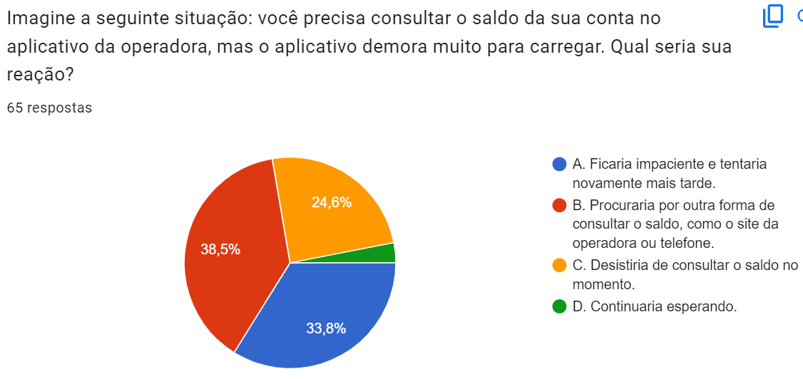

# Entendimento do Usuário

## 1. Objetivos da pesquisa realizada e justificativa

A demora na consulta de cada cliente aos bancos de dados legados da Vivo, que em média dura 30 segundos, pode representar vários custos financeiros para a empresa, como perda de receita direta, custo de suporte ao cliente, reputação da marca, perda de oportunidades de negócios e custo de retenção de clientes. Dessa forma, esta pesquisa busca mensurar a insatisfação e o comportamento dos clientes frente a uma situação de demora em cada requisição aos bancos de dados.

## 2. Imersão Preliminar
Durante o kick-off com os funcionários da Vivo, a mensagem principal que foi comentada é que o benefício de eficiência e retorno financeiro deve ser maior que o custo para migrar um banco de dados para a nuvem, por mais que essa migração aumente a velocidade das requisições. Entretanto, percebemos que a principal vantagem do desenvolvimento dessa aplicação em sistemas distribuídos, é poupar custos como perda de receita e suporte ao cliente. Portanto, trata-se de economia de gastos, apesar de que os custos de um sistema distribuído em nuvem também é alto e será considerado para a comparação com os gastos atuais da Vivo.

Ademais, durante o encontro de pré-sprint do dia 07/02, houve uma grande ênfase na dificuldade em fazer essa migração de dados para a nuvem de uma forma que todos os recursos sejam utilizados de forma eficiente. Um problema apresentado foi o caso em que muitas requisições ao aplicativo são feitas por conta de uma campanha momentânea em um programa televisivo, por exemplo.

## 3. Pesquisa Qualitativa e Quantitativa
A pesquisa qualitativa e quantitativa foi elaborada com perguntas sobre como os usuários reagem em situações em que o sistema demora para consultar informações nos bancos de dados de uma provedora de serviços de telefonia e internet, como a Vivo. Realizada com 65 usuários de serviços de telefonia móvel, a pesquisa revelou uma variedade de experiências, tanto positivas quanto negativas, relacionadas à performance dos serviços oferecidos pelas operadoras. Alguns usuários destacaram problemas como lentidão no acesso aos serviços, instabilidade na conexão, dificuldades no atendimento ao cliente, oscilação de sinal e cobranças indevidas. Por outro lado, também foram mencionados pontos positivos, como estabilidade da conexão em determinadas áreas, custo-benefício atrativo e benefícios adicionais oferecidos pelos planos.
Abaixo estão as perguntas e os resultados em gráficos:

### Sua experiência com sua operadora de celular e internet

#### 1. Com que frequência você utiliza o aplicativo da sua operadora?

a. Diariamente
b. Semanalmente
c. Quinzenalmente
d. Mensalmente
e. Menos de uma vez por mês

#### 2. De modo geral, você está satisfeito com o tempo de resposta do aplicativo da sua operadora?

a. Sim, completamente satisfeito
b. Sim, relativamente satisfeito
c. Nem satisfeito nem insatisfeito
d. Sim, relativamente insatisfeito
e. Não, completamente insatisfeito

#### 3. Já teve sua experiência com a operadora prejudicada pela lentidão do aplicativo na resolução de problemas?

Sim, frequentemente
Sim, ocasionalmente
Não, nunca

#### 4. Imagine a seguinte situação: você precisa consultar o saldo da sua conta no aplicativo da operadora, mas o aplicativo demora muito para carregar. Qual seria sua reação?

A. Ficaria impaciente e tentaria novamente mais tarde.
B. Procuraria por outra forma de consultar o saldo, como o site da operadora ou telefone.
C. Desistiria de consultar o saldo no momento.
D. Continuaria esperando.

#### 5. Quais fatores mais influenciam sua decisão de permanecer com sua operadora atual? (Escolha todas as opções que se aplicam)

A. Preço do plano
B. Qualidade da cobertura
C. Atendimento ao cliente
D. Benefícios adicionais (descontos, programas de fidelidade)
E. Inércia (dificuldade em trocar de operadora)

#### 6. Qual a sua opinião sobre benefícios adicionais oferecidos pelas operadoras, como descontos em lojas e serviços?

A. São muito importantes e podem influenciar minha escolha de operadora.
B. São interessantes, mas não são decisivos na minha escolha.
C. São desnecessários, pois o mais importante é a qualidade do serviço.

#### 7. Durante o horário nobre de um programa de televisão, você decide acessar o site de uma promoção anunciada, mas o site demora muito para carregar. Qual seria sua reação?

A. Sairia do site imediatamente e buscaria a promoção por outro meio.
B. Aguardaria o carregamento do site, pois tenho interesse na promoção.
C. Desistiria da promoção, pois a espera é muito demorada.

### Gráficos:

#### Pergunta dissertativa
Além das perguntas objetivas, a seguinte pergunta dissertativa foi feita para os usuários:

8. Compartilhe livremente suas experiências, positivas ou negativas, relacionadas à performance dos serviços da sua operadora de celular, incluindo aplicativos, sites, atendimento ao cliente e tempo de resposta. Descreva como essas experiências impactam sua satisfação e fidelidade à operadora.

65 pessoas responderam e foi observado que algumas tendências e padrões emergiram:

Muitos usuários expressaram insatisfação com o tempo de resposta, citando lentidão em aplicativos e dificuldades de acesso. Por exemplo, um participante relatou: "Minha experiência com operadoras de celular, houve muitos transtornos como pagamento de contas, até mesmo consultas médicas pelo simples fato de lentidão e instabilidade."

Alguns usuários destacaram a importância de um atendimento eficiente, expressando descontentamento com a automação excessiva. Um deles afirmou: "Acredito que poderia existir um suporte mais eficiente, pois com a ascensão dos 'chat bots', o atendimento ganhou a eficiência e agilidade de uma máquina, porém perdeu a humanidade de um bom atendimento."

Alguns usuários mencionaram permanecer com a mesma operadora devido à falta de opções ou à dificuldade em trocar. Um participante comentou: "Como bem definido em uma das alternativas do questionário, a inércia é tamanha que, em casa, a família mantém a mesma operadora há décadas."

Diversos problemas foram apontados, como oscilação de sinal, dificuldades com aplicativos, cobranças indevidas e falta de informações sobre mudanças na operadora. Por exemplo, um usuário mencionou: "O único problema é que às vezes em lugares que têm sinal ele acaba caindo do nada e sem internet não consigo acessar o próprio aplicativo que mexe na internet."

Dessa forma, a pesquisa destaca a necessidade de melhorar a performance e o tempo de resposta, sugerindo que a implementação de um barramento de dados na nuvem pode contribuir para otimizar esses aspectos. Além disso, há uma demanda por atendimento mais humano e eficiente, indicando que a automação excessiva pode impactar negativamente a experiência do cliente. A resistência à mudança de operadora é evidente, sugerindo que estratégias para facilitar esse processo podem ser bem recebidas pelos usuários. As respostas variam, com alguns usuários satisfeitos com a estabilidade da conexão e custo-benefício, enquanto outros destacam problemas específicos. Isso ressalta a importância de abordagens personalizadas para melhorar a satisfação do cliente. Em última análise, o projeto proposto de desenvolver um barramento de dados na nuvem pode endereçar parte das preocupações dos usuários, proporcionando uma resposta mais rápida e melhorando a experiência geral. 

As respostas obtidas na pesquisa são de extrema relevância para o desenvolvimento do projeto de otimização do tempo de acesso às bases de dados legadas. Elas evidenciam a importância da performance dos serviços de telefonia móvel na satisfação e fidelidade dos clientes. Problemas como lentidão no acesso aos aplicativos e sites das operadoras podem impactar negativamente a experiência do usuário e influenciar sua decisão de permanecer ou não com a operadora.

Além disso, as respostas destacam a necessidade de uma infraestrutura de comunicação eficiente para garantir uma conexão estável e rápida, especialmente considerando o acesso às bases de dados legadas. Portanto, ao desenvolver o projeto de implementação de um barramento de dados na nuvem, é essencial considerar esses aspectos para proporcionar uma experiência satisfatória aos usuários finais, reduzindo o tempo de resposta e aumentando a eficiência no acesso às informações.
