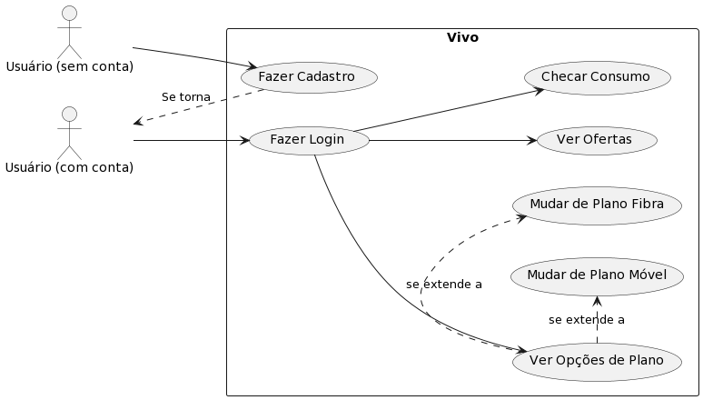
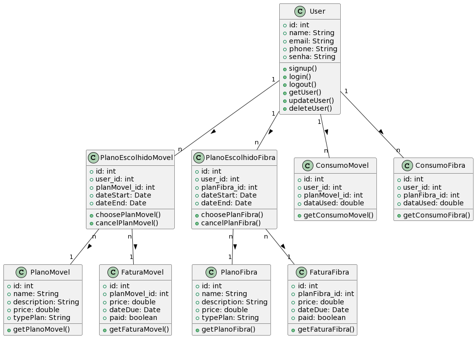
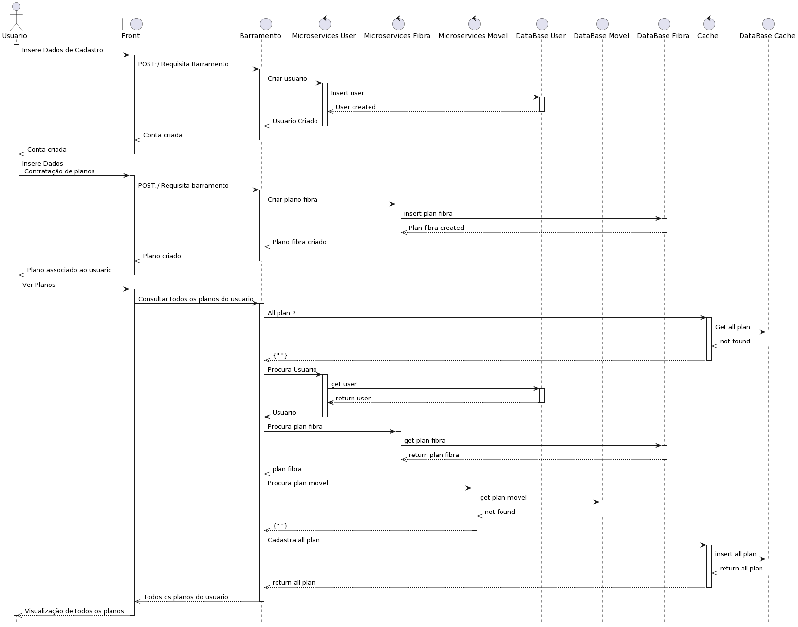
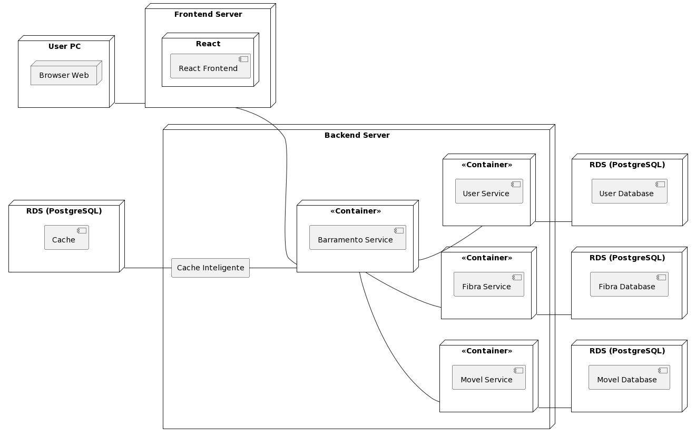

## Diagrama e descrições dos casos de uso

### Fazer Cadastro

| Seção                       | Descrição                                                                                                                                                                                                     |
| ----------------------------- | --------------------------------------------------------------------------------------------------------------------------------------------------------------------------------------------------------------- |
| Nome do Caso de Uso           | Fazer Cadastro                                                                                                                                                                                                  |
| Escopo                        | Aplicação web da operadora Vivo                                                                                                                                                                        |
| Nível                        | Objetivo do usuário                                                                                                                                                                                            |
| Ator Principal                | Novo cliente                                                                                                                                                                                                    |
| Interessados e Interesses     | Novo cliente: Deseja criar uma conta para acessar serviços e ofertas. Operadora Vivo: Quer facilitar o processo de registro para aumentar a base de clientes.                                                  |
| Pré-condições              | O usuário não possui uma conta existente.                                                                                                                                                                     |
| Garantia de Sucesso           | O cliente cria uma nova conta com sucesso.                                                                                                                                                                      |
| Cenário de Sucesso Principal | 1. O usuário seleciona "Criar Conta". 2. O usuário fornece informações pessoais necessárias. 3. O sistema valida as informações e cria a nova conta. 4. O usuário recebe uma confirmação do cadastro. |
| Extensões                    | 1. Se o usuário fornece informações inválidas, o sistema notifica e solicita correções. 2. Se o usuário escolhe um cpf, ou telefone, já em uso, o sistema solicita a escolha de um novo.                 |
| Requisitos Especiais          | O sistema deve garantir a segurança e privacidade dos dados do usuário.                                                                                                                                       |
| Lista de Variantes            | O sistema pode oferecer a opção de cadastro via redes sociais ou e-mail.                                                                                                                                      |
| Frequência de Ocorrência    | Ocasional, no primeiro acesso do usuário.                                                                                                                                                                      |
| Problemas em Aberto           | Como validar efetivamente a identidade do usuário para evitar fraudes?                                                                                                                                         |

### Fazer Login

| Seção                       | Descrição                                                                                                                                             |
| ----------------------------- | ------------------------------------------------------------------------------------------------------------------------------------------------------- |
| Nome do Caso de Uso           | Fazer Login                                                                                                                                             |
| Escopo                        | Aplicação web da operadora Vivo                                                                                                                |
| Nível                        | Objetivo do usuário                                                                                                                                    |
| Ator Principal                | Cliente registrado                                                                                                                                      |
| Interessados e Interesses     | Cliente registrado: Quer acessar sua conta para gerenciar serviços. Operadora Vivo: Quer oferecer acesso seguro e conveniente à conta.                |
| Pré-condições              | O cliente já possui uma conta registrada.                                                                                                              |
| Garantia de Sucesso           | O cliente acessa sua conta com sucesso.                                                                                                                 |
| Cenário de Sucesso Principal | 1. O cliente insere seu cpf, ou telefone, e senha. 2. O sistema verifica as credenciais e concede acesso. 3. O cliente acessa a home da conta.       |
| Extensões                    | 1. Se o cliente esqueceu a senha, ele pode solicitar uma redefinição. 2. Se as credenciais são inseridas incorretamente, o sistema rejeita o acesso. |
| Requisitos Especiais          | Autenticação de dois fatores pode ser requerida para maior segurança.                                                                                |
| Lista de Variantes            | O login pode ser realizado através de reconhecimento biométrico em dispositivos compatíveis.                                                         |
| Frequência de Ocorrência    | Diária, conforme o cliente necessita acessar sua conta.                                                                                                |
| Problemas em Aberto           | Como lidar com tentativas de acesso suspeitas ou múltiplas falhas de login?                                                                            |

### Checar Consumo

| Seção                       | Descrição                                                                                                                                                                           |
| ----------------------------- | ------------------------------------------------------------------------------------------------------------------------------------------------------------------------------------- |
| Nome do Caso de Uso           | Checar Consumo                                                                                                                                                                        |
| Escopo                        | Aplicação web da operadora Vivo                                                                                                                                              |
| Nível                        | Objetivo do usuário                                                                                                                                                                  |
| Ator Principal                | Cliente da operadora Vivo                                                                                                                                                             |
| Interessados e Interesses     | Cliente: Quer estar informado sobre seu consumo atual de dados. Operadora Vivo: Quer proporcionar transparência e evitar reclamações ou confusões sobre uso. |
| Pré-condições              | O cliente está logado na aplicação.                                                                                                                                                |
| Garantia de Sucesso           | O cliente consegue visualizar detalhadamente seu consumo atual.                                                                                                                       |
| Cenário de Sucesso Principal | 1. O cliente acessa a seção "Consumo" na aplicação. 2. O sistema exibe o consumo atual de dados. 3. O cliente revisa os detalhes do seu consumo.                                  |
| Extensões                    | 1. Se o sistema não puder recuperar os dados, informar o cliente e oferecer uma tentativa de atualização.                                                                          |
| Requisitos Especiais          | A informação deve ser atualizada em tempo real ou próximo disso.                                                                                                                   |
| Lista de Variantes            | O consumo pode ser exibido em diferentes formatos, como gráficos ou listas.                                                                                                          |
| Frequência de Ocorrência    | Alta, pois clientes podem checar o consumo várias vezes ao mês.                                                                                                                     |
| Problemas em Aberto           | Determinar como lidar com atrasos na atualização de dados de consumo no sistema.                                                                                                    |

### Ver Opções de Plano

| Seção                       | Descrição                                                                                                                                                                    |
| ----------------------------- | ------------------------------------------------------------------------------------------------------------------------------------------------------------------------------ |
| Nome do Caso de Uso           | Ver Opções de Plano                                                                                                                                                          |
| Escopo                        | Aplicação web da operadora Vivo                                                                                                                                       |
| Nível                        | Objetivo do usuário                                                                                                                                                           |
| Ator Principal                | Cliente da operadora Vivo                                                                                                                                                      |
| Interessados e Interesses     | Cliente: Quer conhecer os planos disponíveis para tomar uma decisão informada. Operadora Vivo: Quer apresentar os planos de forma clara para facilitar a escolha do cliente. |
| Pré-condições              | O cliente está logado.                                                                                                                        |
| Garantia de Sucesso           | O cliente encontra informações claras sobre as opções de plano e compreende as diferenças entre elas.                                                                     |
| Cenário de Sucesso Principal | 1. O cliente navega até a seção "Planos". 2. O sistema lista as opções de planos disponíveis. 3. O cliente seleciona um plano para ver mais detalhes.                    |
| Extensões                    | 1. Se o cliente não encontrar um plano satisfatório, ele pode solicitar uma consulta para planos personalizados.                                                             |
| Requisitos Especiais          | Deve haver filtros ou ferramentas de busca para ajudar o cliente a encontrar planos conforme suas necessidades.                                                                |
| Lista de Variantes            | Informações do plano podem ser exibidas em diferentes línguas ou formatos acessíveis, como áudio ou vídeo.                                                               |
| Frequência de Ocorrência    | Moderada, clientes costumam procurar planos quando estão próximos do fim de seu ciclo de faturamento.                                                                        |
| Problemas em Aberto           | Integrar feedback do cliente para melhorar a apresentação e informações dos planos.                                                                                        |

### Mudar de Plano Móvel/Fibra

| Seção                       | Descrição                                                                                                                                                                                                                                                                    |
| ----------------------------- | ------------------------------------------------------------------------------------------------------------------------------------------------------------------------------------------------------------------------------------------------------------------------------ |
| Nome do Caso de Uso           | Mudar de Plano Móvel / Mudar de Plano Fibra                                                                                                                                                                                                                                   |
| Escopo                        | Aplicação web da operadora Vivo                                                                                                                                                                                                                                       |
| Nível                        | Objetivo do usuário                                                                                                                                                                                                                                                           |
| Ator Principal                | Cliente da operadora Vivo                                                                                                                                                                                                                                                      |
| Interessados e Interesses     | Cliente: Deseja alterar seu plano atual para outro que melhor atenda suas necessidades. Operadora Vivo: Quer facilitar o processo de mudança de planos para manter a satisfação do cliente.                                                                                 |
| Pré-condições              | O cliente está logado e  e tem um plano ativo atualmente.                                                                                                                                                                                                      |
| Garantia de Sucesso           | O cliente consegue mudar de plano sem complicações e está satisfeito com a nova escolha.                                                                                                                                                                                    |
| Cenário de Sucesso Principal | 1. O cliente seleciona "Mudar Plano" nas opções de planos. 2. O sistema apresenta as opções de plano disponíveis para mudança. 3. O cliente escolhe um novo plano e confirma a mudança. 4. O sistema processa a mudança e notifica o cliente do sucesso da operação. |
| Extensões                    | 1. Se houver requisitos adicionais para a mudança de plano, o sistema solicita ao cliente que cumpra esses requisitos.                                                                                                                                                        |
| Requisitos Especiais          | A mudança de planos deve ser uma transição suave, mantendo o número do cliente e preferências intactas.                                                                                                                                                                   |
| Lista de Variantes            | Opções para agendamento de mudança de plano ou adaptações para diferentes regiões e regulamentações.                                                                                                                                                                   |
| Frequência de Ocorrência    | Baixa a moderada, dependendo da satisfação do cliente com seu plano atual.                                                                                                                                                                                                   |
| Problemas em Aberto           | Minimizar o tempo de inatividade durante a mudança de plano e comunicar eficazmente as mudanças ao cliente.                                                                                                                                                                  |
## Diagrama de Classes

### User (Usuário)

- Esta classe representa os usuários do sistema.
- Cada usuário tem um identificador único (id), nome, email, telefone e senha.
- Os métodos incluem funcionalidades para cadastro (`signUp`), login, logout, obtenção dos dados (`getUser`), atualização (`updateUser`) e exclusão (`deleteUser`) de informações do usuário.

### PlanoMovel (Plano Móvel)

- Representa os diferentes planos móveis disponíveis.
- Cada plano móvel tem um id, nome, descrição, preço e tipo de plano.
- Um método permite obter detalhes do plano móvel (`getPlanoMovel`).

### PlanoFibra (Plano Fibra)

- Representa os diferentes planos fibra disponíveis.
- Cada plano fibra tem um id, nome, descrição, preço e tipo de plano.
- Um método permite obter detalhes do plano fibra (`getPlanoFibra`).

### PlanoEscolhidoMovel (Plano Escolhido Móvel)

- Registra os planos móveis escolhidos pelos usuários.
- Inclui id, user_id (associado ao Usuário), planMovel_id (associado ao Plano Móvel), datas de início e término do plano.
- Métodos para escolher (`choosePlanMovel`) e cancelar (`cancelPlanMovel`) um plano móvel.

### PlanoEscolhidoFibra (Plano Escolhido Fibra)

- Registra os planos fibra escolhidos pelos usuários.
- Inclui id, user_id (associado ao Usuário), planFibra_id (associado ao Plano Fibra), datas de início e término do plano.
- Métodos para escolher (`choosePlanFibra`) e cancelar (`cancelPlanFibra`) um plano fibra.

### ConsumoMovel (Consumo Móvel)

- Monitora o consumo do usuário em seus planos móveis.
- Contém id, user_id, planMovel_id e a quantidade de dados usados (`dataUsed`).
- Um método fornece acesso ao consumo móvel (`getConsumoMovel`).

### ConsumoFibra (Consumo Fibra)

- Monitora o consumo do usuário em seus planos Fibra.
- Contém id, user_id, planFibra_id e a quantidade de dados usados (`dataUsed`).
- Um método fornece acesso ao consumo fibra (`getConsumoFibra`).

### FaturaMovel (Fatura Móvel)

- Registra faturas para planos móveis escolhidos.
- Inclui id, planMovel_id (associado ao Plano Escolhido Móvel), preço, data de vencimento e status do pagamento.
- Um método para obter detalhes da fatura móvel (`getFaturaMovel`).

### FaturaFibra (Fatura Fibra)

- Registra faturas para planos fibra escolhidos.
- Inclui id, planFibra_id (associado ao Plano Escolhido Fibra), preço, data de vencimento e status do pagamento.
- Um método para obter detalhes da fatura fibra (`getFaturaFibra`).

O diagrama visualiza claramente a relação entre usuários e seus planos e consumo, além do rastreamento financeiro através das faturas.

## Diagrama de Sequência UML

1. O usuário começa inserindo seus dados de cadastro no front-end da aplicação.
2. O front-end envia uma requisição POST para o serviço de barreamento para criar o usuário.
3. O serviço de barreamento processa essa requisição e encaminha o comando para criar o usuário no microsserviço de usuários (Microservices User).
4. O microsserviço de usuários executa um insert user no banco de dados de usuários (DataBase User).
5. Após o usuário ser criado com sucesso no banco de dados, o microserviço de usuários informa ao serviço de barreamento que o usuário foi criado (User created).
6. O serviço de barreamento então envia uma resposta de volta para o front-end informando que a conta foi criada com sucesso.
7. O usuário insere dados para a contratação de planos no front-end.
8. O front-end envia outra requisição POST para o serviço de barreamento para criar o plano.
9. O serviço de barreamento encaminha o comando para criar o plano para o microsserviço de fibra (Microservices Fibra).
10. O microsserviço de fibra executa um insert plan fibra no banco de dados de fibra (DataBase Fibra).
11. Após a criação bem-sucedida do plano no banco de dados, o serviço de microsserviços de fibra informa ao serviço de barreamento que o plano foi criado (Plan fibra created).
12. O serviço de barreamento responde ao front-end que o plano foi criado e associado ao usuário.
13. Para consultar todos os planos do usuário, uma nova ação é iniciada no front-end.
14. O front-end solicita ao serviço de barreamento que recupere todos os planos do usuário.
15. O serviço de barramento encaminha o comando para pegar todos os planos para o microsserviço de cache inteligente.
16. O microsserviço Cache executa um get para o DataBase Cache para pegar todos os planos do usuario.
17. O DataBase retorna para o microsserviço Cache que os planos não foram encontrados.
18. O microsserviço Cache retorna para o barramento que não a dados no Cache inteligente.
19. O serviço de barreamento realiza consultas nos microsserviços apropriados para obter os planos de fibra e móvel do usuário (get plan fibra e get plan movel).
20. O microserviço de fibra e móvel busca as informações nos respectivos bancos de dados. O plano de fibra é encontrado, mas o plano móvel não é encontrado (not_found).
21. O serviço de barreamento agrega todos os planos encontrados e realiza um insert all plan no cache inteligente.
22. O serviço de cache inteligente retorna todos os planos para o serviço de barreamento.
23. Finalmente, o front-end recebe a informação e a apresenta para o usuário, permitindo que este visualize todos os seus planos.

Essa jornada mostra a criação de uma conta de usuário, a contratação de um plano de serviço e a visualização de todos os planos associados a um usuário em uma arquitetura de microserviços que utiliza um banco de dados separado para cada serviço e um cache para otimizar o desempenho.

## Diagrama de Implantação UML

A imagem apresenta a arquitetura de uma aplicação web que divide claramente o front-end e o back-end, indicando também a utilização de uma abordagem baseada em microserviços no back-end.

*Front-end:*

- O usuário interage com a aplicação através de um navegador web em seu computador pessoal (User PC).
- O front-end é construído com React e é servido a partir de um servidor front-end.
- A interface React front-end é o que o usuário vê e interage, realizando pedidos de informação e enviando dados.

*Back-end:*

- O back-end é hospedado em um servidor separado e consiste em múltiplos serviços encapsulados em contêineres. Esses serviços podem incluir, mas não se limitam a, um serviço de usuário (User Service), um serviço de barreamento (Barreamento Service), um serviço de fibra (Fibra Service) e um serviço móvel (Movel Service).
- Cada serviço de microserviço interage com seu próprio banco de dados PostgreSQL gerenciado pelo Amazon RDS (Relational Database Service), indicado como User Database, Fibra Database e Movel Database.
- Existe também um serviço de cache inteligente que provavelmente é usado para melhorar o desempenho da aplicação, minimizando o número de acessos diretos ao banco de dados e acelerando a entrega de dados frequentemente requisitados.
- O serviço de cache inteligente interage com um banco de dados RDS PostgreSQL designado como cache.

Na operação normal, quando o usuário realiza uma ação no front-end, como enviar um formulário ou solicitar dados, a requisição é enviada do navegador para o servidor front-end, que por sua vez comunica com o servidor back-end. O servidor back-end, dependendo da natureza da solicitação, irá encaminhar a requisição para o serviço de microserviço apropriado. Esse serviço processará a solicitação, interagindo com seu banco de dados específico se necessário. Se a informação solicitada puder ser fornecida pelo cache inteligente, isso pode reduzir a latência e melhorar a resposta ao usuário. Após o processamento, a resposta é enviada de volta ao front-end, que atualiza a interface do usuário de acordo com a informação recebida.
