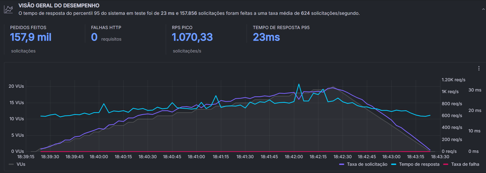

# Testes de Carga para validar os requisitos não funcionais

## Resultado dos testes de carga do RNF1.

Após os feedbacks da primeira sprint, reavaliamos nossos requisitos não funcionais e planejamos seus respectivos planos de teste

**RNF 01** - Desempenho:O tempo de resposta entre a requisição do usuário e o barramento de dados deve ser inferior a 3 segundos.

Plano de teste: Realizar testes de carga utilizando ferramentas para simular o tráfego de usuários em diferentes cenários de pico e verificar se o tempo de resposta para o usuário se mantém abaixo de 3 segundos. Através do Grafana K6, monitorar o desempenho em tempo real durante os testes para identificar possíveis problemas e otimizações necessárias.

**RNF 02** - Elasticidade e Usabilidade: O sistema precisa ser escalável o bastante para suportar picos de demanda sem comprometer a qualidade de serviço, garantindo uma experiência contínua e satisfatória para os usuários.

Plano de teste: Realizar testes de escalabilidade para avaliar a capacidade do sistema de lidar com uma quantidade de usuários flutuante. Durante os testes, através do Grafana K6, monitorar o tempo de resposta e a utilização de recursos para assegurar a eficácia do ajuste automático de escala.

Neste teste, testamos os três micro serviços, sendo eles vivoFibra, vivoMovel e vivoUser. Para testar os três micro serviços, utilizamos um script com o k6 para simular configurações diferentes de usuários virtuais ao decorrer de 4 minutos para verificar se o barramento seria capaz de retornar os dados da requisição em menos de 3 minutos em diferentes cenários.

- No primeiro minuto, foram utilizados 10 usuários virtuais
- Do segundo ao terceiro minuto, foram utilizados 20 usuários virtuais
- No último minuto, foi gradualmente reduzido até 0 usuários.

Depois desse teste, foi verificado que o tempo máximo de resposta foi 780 microssegundos com um total de 18100 requisições.

A partir do gráfico, pode ser visto que o pico foi atingido no final do terceiro minuto, onde tinha a maior quantidade de usuários. Após realizar o teste, podemos concluir que o requisito não funcional foi cumprido, visto que o pico não passou nem mesmo de um segundo. É válido ressaltar que o P95, que é o tempo de resposta que leva para 95% das requisições serem feitas foi de 651 microssegundos. Este valor, embora ligeiramente superior ao ideal, ainda é considerado aceitável para os nossos micro serviços, especialmente em cenários com um número moderado de usuários.

A taxa média de solicitação durante o teste foi de 78,7 solicitações por segundo. Essa medida demonstra a capacidade do sistema de processar um volume considerável de requisições continuamente. Além disso, o pico de carga atingiu 80 solicitações por segundo. Esse valor indica que o sistema pode lidar com surtos repentinos de tráfego sem comprometer a performance, garantindo uma boa experiência mesmo em momentos de alta demanda.

Por fim, o teste registrou 0 falhas de HTTP, comprovando a estabilidade excepcional do sistema durante a carga. Essa confiabilidade robusta é crucial para garantir a disponibilidade contínua do sistema e a satisfação dos usuários, mesmo durante períodos de uso intenso.

Destarte, o teste de carga revela um sistema com bom desempenho geral, capaz de lidar com um número moderado de solicitações de forma estável. A alta taxa de solicitação, o tempo de resposta aceitável e a ausência de falhas de HTTP demonstram a capacidade do sistema de oferecer uma experiência de qualidade para os usuários, garantindo a validação do RNF1.

## Resultado dos testes de carga do RNF2.

### 1° Teste:

O primeiro teste de carga foi executado com 20 usuários virtuais (VUs) por 5 minutos, simulando um cenário de uso real do sistema.

A taxa média de solicitação durante o teste foi de 624 solicitações por segundo. A taxa de pico de solicitação atingiu 1.070,33 solicitações por segundo, indicando que o sistema pode lidar com um grande volume de tráfego simultâneo, sem comprometer a qualidade do serviço. Além disso, o tempo de resposta P95, que representa o tempo que leva para 95% das solicitações serem processadas, foi de 23 milissegundos. Este valor é considerado aceitável para nossos micro serviços, pois garante uma experiência fluida para os usuários. Por fim, o teste não registrou nenhuma falha de HTTP, o que demonstra a estabilidade do sistema durante a carga. Dessa forma, o primeiro teste de carga suporta o RNF 2.

### 2° Teste:

O segundo teste de carga teve um pico de 100 usuários simultâneos, número que variou durante 4 minutos e 12 segundos de teste. A taxa média de solicitação durante o teste foi de 624 solicitações por segundo, demonstrando a capacidade do sistema de processar um volume significativo de requisições Além disso, o pico de 1.070,33 solicitações por segundo indica que o sistema pode lidar com surtos repentinos de tráfego sem comprometer a performance. 

O tempo de resposta P95, que representa o tempo que 95% das solicitações levaram para serem processadas, foi de 23 milissegundos, este valor é considerado excelente para nossos micro serviços, pois garante uma experiência rápida e responsiva para a maioria dos usuários. Por fim, o teste não registrou nenhuma falha de HTTP, o que demonstra a alta estabilidade do sistema durante a carga. Essa confiabilidade é crucial para garantir a disponibilidade do sistema e a satisfação dos usuários, o que valida o RNF 2.

### 3° Teste:

O último teste realizado foi o mais ousado, testando o limite dos nossos micro serviços, com mais de meio milhão de requisições durante 9 minutos, fornecendo insights valiosos sobre a resiliência e o desempenho do sistema sob carga sustentada. 

A taxa média de solicitação durante o teste foi de 995 solicitações por segundo, demonstrando a capacidade notável do sistema de processar um volume significativo de requisições continuamente por 9 minutos. Além disso, o pico de 1.200 solicitações por segundo indica que o sistema pode lidar com surtos repentinos de tráfego sem comprometer a performance, mesmo durante um período de carga extenso.

O tempo de resposta P95, que representa o tempo que 95% das solicitações levaram para serem processadas, foi de 94 milissegundos. Este valor, embora ligeiramente superior ao ideal, ainda é considerado aceitável para os nossos micro serviços, especialmente sob carga sustentada por um período prolongado.

Por fim, o teste registrou 0 falhas de HTTP, comprovando a estabilidade excepcional do sistema durante a carga. Essa confiabilidade robusta é crucial para garantir a disponibilidade contínua do sistema e a satisfação dos usuários, mesmo durante períodos de uso intenso.

A duração de 9 minutos diferencia este último teste como ousado e fornece insights valiosos sobre o comportamento do sistema sob carga sustentada, pois monitorar o desempenho ao longo de um período mais extenso permite identificar potenciais problemas de escalabilidade e garantir a confiabilidade a longo prazo. Desta forma, este último teste de carga revela a resiliência e o desempenho consistente do sistema sob carga prolongada. A alta taxa de solicitação, o tempo de resposta aceitável e a ausência de falhas de HTTP demonstram a capacidade do sistema de lidar com um grande número de usuários e oferecer uma experiência de qualidade, mesmo durante períodos de uso intenso, por conseguinte, o RNF 2 também foi validado pelo nosso último teste de carga.
