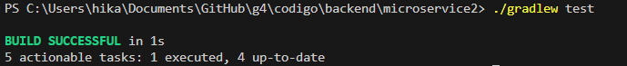
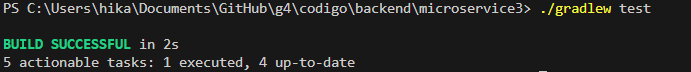
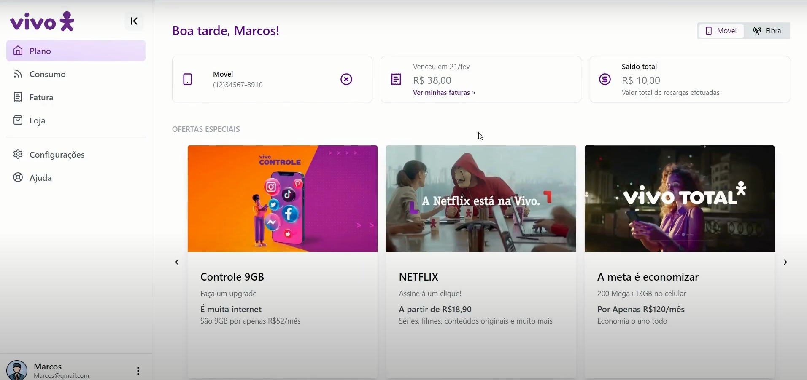

# Testes do Sistema

## Testes de Cenário
### RF0: Cadastro de usuários na aplicação
| Cenário                 | Passos                                                                                                      | Resultado Esperado                                     | Resultado Obtido |
|-------------------------|-------------------------------------------------------------------------------------------------------------|--------------------------------------------------------|------------------|
| Cadastrar usuário | 1. Acessar a página de cadastro 2. Preencher todos os campos obrigatórios 3. Submeter o formulário    | Cadastro realizado com sucesso                         |   Cadastro realizado com sucesso               |
| Campos obrigatórios vazios| 1. Acessar a página de cadastro 2. Deixar um ou mais campos obrigatórios em branco 3. Submeter o formulário| Mensagem de erro e fomulário não submetido         |  Mensagem de erro indicando que todos os campos devem ser preenchidos para finalizar o cadastro e o formulário não foi submetido                |
| Verificação de credenciais      | 1. Acessar a página de cadastro 2. Usar um email ou telefone inválido 3. Submeter o formulário                | Mensagem de erro e fomulário não submetido   |  Mensagem de erro indicando que as credenciais não são válidas  e o formulário não foi submetido              |

### RF1: Login do usuário
| Cenário                 | Passos                                                                                        | Resultado Esperado                           | Resultado Obtido |
|-------------------------|-----------------------------------------------------------------------------------------------|----------------------------------------------|------------------|
| Login com sucesso       | 1. Acessar a página de login 2. Inserir credenciais válidas 3. Submeter o formulário    | Acesso concedido                             |     Acesso concedido             |
| Credenciais incorretas         | 1. Acessar a página de login 2. Inserir um email incorreto 3. Submeter o formulário     | Mensagem de erro e acesso não concedido     |    Mensagem de erro indicando as credenciais incorretas e o acesso não é concedido              |

### RF2: Consulta de informações do plano atual
| Cenário                           | Passos                                                                                      | Resultado Esperado                              | Resultado Obtido |
|-----------------------------------|---------------------------------------------------------------------------------------------|-------------------------------------------------|------------------|
| Consulta com sucesso              | 1. Logar com um usuário válido 2. Encontrar as informações do plano na página inicial                | Exibição das informações do plano atual         |    Exibição das informações do plano atual              |
| Sem plano ativo                   | 1. Logar com um usuário sem plano ativo 2. Acessar a seção de informações do plano       | Mensagem indicando que não há plano ativo       |  Na seção de planos está escrito sem plano                |

### RF3: Visualização e recebimento de notificações sobre novas ofertas
| Cenário                       | Passos                                                                                            | Resultado Esperado                               | Resultado Obtido |
|-------------------------------|---------------------------------------------------------------------------------------------------|--------------------------------------------------|------------------|
| Receber notificações          | 1. Logar com sucesso 2. Acessar a plataforma                                                    | Recebimento de notificações sobre novas ofertas  |   Não apareceram as notificaçõs, pois essa função ainda não foi implementada               |
| Visualizar novas ofertas      | 1. Logar com sucesso 2. Encontrar a seção de ofertas na página inicial                                            | Visualização das novas ofertas disponíveis       |  Visualização das novas ofertas disponíveis                |

### RF4: Consulta de informações cadastrais do usuário
| Cenário                        | Passos                                                                                               | Resultado Esperado                                     | Resultado Obtido |
|--------------------------------|------------------------------------------------------------------------------------------------------|--------------------------------------------------------|------------------|
| Consulta de informações com sucesso| 1. Logar com um usuário válido 2. Acessar a seção de perfil                       | Exibição das informações cadastrais do usuário         |  Os dados não foram exibidos, pois essa função ainda não foi integrada                |

### RF5: Acesso a informações de Vivo Móvel ou Vivo Fibra
| Cenário                           | Passos                                                                                             | Resultado Esperado                                    | Resultado Obtido |
|-----------------------------------|----------------------------------------------------------------------------------------------------|-------------------------------------------------------|------------------|
| Acessar detalhes do plano Vivo Móvel| 1. Logar com um usuário válido 2. Encontrar as informações do plano na página inicial               | Exibição das informações do plano Móvel|                  | A exibição dos detalhes do Plano Móvel(Nome do plano, créditos e fatura)
| Acessar detalhes do plano Vivo Fibra | 1. Logar com um usuário válido 2. Acessar a página inicial 3. Mudar a visualização para Fibra               | Exibição das informações do plano Fibra |  A exibição dos detalhes do Plano Fibra(Nome do plano, adicionais do pacote e fatura)                |

### RF6: Edição de informações pessoais
| Cenário                         | Passos                                                                                                     | Resultado Esperado                              | Resultado Obtido |
|---------------------------------|------------------------------------------------------------------------------------------------------------|-------------------------------------------------|------------------|
| Edição de informações com sucesso| 1. Logar com um usuário válido 2. Acessar a seção para editar informações pessoais 3. Alterar os dados 4. Submeter as alterações | Informações pessoais atualizadas com sucesso    |   Não foi possível alterar as informações, pois essa função ainda não foi integrada               |

### RF7: Exclusão da conta seguindo as diretrizes da LGPD
| Cenário                          | Passos                                                                                                     | Resultado Esperado                                   | Resultado Obtido |
|----------------------------------|------------------------------------------------------------------------------------------------------------|------------------------------------------------------|------------------|
| Exclusão de conta com sucesso    | 1. Logar com um usuário válido 2. Acessar a seção de configurações da conta 3. Solicitar exclusão da conta 4. Confirmar a exclusão | Conta excluída com sucesso          |      A conta não foi excluída, pois essa função ainda não integrada            |

## Testes Unitários
### Móvel
| **Aspecto**                 | **Detalhes**                                                                                                                                                                                                                                                                                                                                                                                                                 |
|-----------------------------|---------------------------------------------------------------------------------------------------------------------------------------------------------------------------|
| **Objetivo**                | Testar as operações da controller `VivoMovelController`.      |
| **Método de Teste**         | JUnit     |
| **Pacote testado**                  | `com.example.vivoMovel.controllers`     |
| **Classe de Teste**         | `VivoMovelControllerTest`    |
| **Arquivo de Teste**        | `VivoMovelApplicationTests`  |
| **Dependências**            | `VivoMovelRepository`, `VivoMovelModel`, `VivoMovelDto`, `HttpStatus`, `ResponseEntity` |
| **Cenários de Teste**       | - **Cenário 1: Testar o método `addMovel` (POST)** Verificar se um plano de Vivo Móvel é adicionado corretamente para um usuário no banco de dados. Verificar se o retorno da resposta HTTP é `200 OK` após a adição do plano. - **Cenário 2: Testar o método `getMovel` (GET)** Verificar se todos os planos dos usuários de Vivo Móvel são retornados corretamente. Verificar se o retorno da resposta HTTP é `200 OK` quando há planos disponíveis. - **Cenário 3: Testar o método `getMovelById` (GET)** Verificar se um plano de Vivo Móvel é retornado corretamente pelo ID do usuário. Verificar se o retorno da resposta HTTP é `200 OK` quando o plano é encontrado. - **Cenário 4: Testar o método `attMovel` (PUT)** Verificar se um plano de Vivo Móvel é atualizado corretamente pelo ID do usuário. Verificar se o retorno da resposta HTTP é `200 OK` após a atualização do plano. - **Cenário 5: Testar o método `deleteMovel` (DELETE)** Verificar se um plano de Vivo Móvel é excluído corretamente pelo ID do usuário. Verificar se o retorno da resposta HTTP é `200 OK` após a exclusão do plano. |
| **Resultado Esperado**      | - Os métodos da controller devem ser testados com sucesso, garantindo que as operações de CRUD sejam realizadas corretamente e que as respostas HTTP estejam de acordo com o esperado.                                                                                                                                                                                                                                       |
| **Resultado Obtido**        |  A execução dos testes unitários para a `VivoMovelController` foi feita com sucesso, com todos os cenários de teste passando. A build automatizada, incluindo a fase de testes, foi completada com sucesso, indicando a ausência de erros e comportamento esperado das funcionalidades testadas. |
#### Anexos teste móvel:

### Fibra
| **Aspecto**                 | **Detalhes**                                                                                                                                                                                                                                                                                                                                                                                                                      |
|-----------------------------|-----------------------------------------------------------------------------------------------------------------------------------------------------------------------------------------------------------------------------------------------------------------------------------------------------------------------------------------------------------------------------------------------------------------------------------|
| **Objetivo**                | Testar as operações da controller `VivoFibraController`.                                                                                                                                                                                                                                                                                                                                                                         |
| **Método de Teste**         | JUnit                                                                                                                                                                                                                                                                                                                                                                                                                             |
| **Pacote testado**                  | `com.example.vivoFibra.controllers`                                                                                                                                                                                                                                                                                                                                                                                               |
| **Classe de Teste**         | `VivoFibraControllerTest`                                                                                                                                                                                                                                                                                                                                                                                                         |
| **Arquivo de Teste**        | `VivoFibraApplicationTests`                                                                                                                                                                                                                                                                                                                                                                                                       |
| **Dependências**            | `VivoFibraRepository`, `VivoFibraModel`, `VivoFibraDto`, `HttpStatus`, `ResponseEntity`, `LocalDate`                                                                                                                                                                                                                                                                                                                 |
| **Cenários de Teste**       | - **Cenário 1: Testar o método `addFibra` (POST)** Verificar se um plano de Vivo Fibra é adicionado corretamente a um usuário no banco de dados. Verificar se o retorno da resposta HTTP é `200 OK` após a adição do plano. - **Cenário 2: Testar o método `getFibra` (GET)** Verificar se todos os planos dos usuários de Vivo Fibra são retornados corretamente. Verificar se o retorno da resposta HTTP é `200 OK` quando há planos disponíveis. - **Cenário 3: Testar o método `getFibraById` (GET)** Verificar se um plano de Vivo Fibra é retornado corretamente pelo ID do usuário. Verificar se o retorno da resposta HTTP é `200 OK` quando o plano é encontrado. - **Cenário 4: Testar o método `attFibra` (PUT)** Verificar se um plano de Vivo Fibra de um usuário é atualizado corretamente pelo ID do usuário. Verificar se o retorno da resposta HTTP é `200 OK` após a atualização do plano. - **Cenário 5: Testar o método `deleteFibra` (DELETE)** Verificar se um plano de Vivo Fibra de um usuário é excluído corretamente pelo ID do usuário. Verificar se o retorno da resposta HTTP é `200 OK` após a exclusão do plano. |
| **Resultado Esperado**      | - Os métodos da controller devem ser testados com sucesso, garantindo que as operações de CRUD sejam realizadas corretamente e que as respostas HTTP estejam de acordo com o esperado.                                                                                                                                                                                                                                            |
| **Resultado Obtido**        | A execução dos testes unitários para a `VivoFibraController` foi feita com sucesso, com todos os cenários de teste passando. A build automatizada, incluindo a fase de testes, foi completada com sucesso, indicando a ausência de erros e comportamento esperado das funcionalidades testadas. |

#### Anexos teste móvel:

## Testes de Integração
### Teste 1: Integração Cadastro -> Login
| **Descrição**                  | Verificar a integração entre o cadastro do usuário (RF0) e o login (RF1) |
|--------------------------------|--------------------------------------------------------------------------|
| **Passos para execução**       | 1. Acessar a página de cadastro e criar um novo usuário. 2. Completar o processo de cadastro com dados válidos. 3. Tentar fazer login utilizando as credenciais do novo usuário. |
| **Resultado esperado**         | O usuário deve ser capaz de fazer login imediatamente após o cadastro sem erros. |
| **Resultado obtido**           | Conta criada e acessada com sucesso |
#### Anexos teste 1:

### Teste 2: Integração Login -> Consulta de Informações do Plano
| **Descrição**                  | Verificar a integração entre o login do usuário (RF1) e a consulta de informações do plano atual (RF2) |
|--------------------------------|--------------------------------------------------------------------------------------------------------|
| **Passos para execução**       | 1. Realizar o login com um usuário que possui um plano ativo. 2. Encontrar na página inicial a seção para consulta de informações do plano atual.  |
| **Resultado esperado**         | As informações do plano atual do usuário logado devem ser exibidas. |
| **Resultado obtido**           | As informações do plano do usuário foram exibidas com sucesso |
#### Anexos teste 2:

### Teste 3: Integração Consulta de Dados do Plano -> Visualização de Ofertas
| **Descrição**                  | Verificar a integração entre a consulta de dados do plano (RF2) e a visualização de novas ofertas (RF3) |
|--------------------------------|----------------------------------------------------------------------------------------------------------|
| **Passos para execução**       | 1. Logar com um usuário que tenha um plano ativo. 2. Consultar os dados do plano atual. 3. Acessar a seção de novas ofertas disponíveis para o plano do usuário. 4. Verificar se as ofertas apresentadas são relevantes para o plano do usuário. |
| **Resultado esperado**         | As ofertas apresentadas devem ser relevantes para o plano atual do usuário. |
| **Resultado obtido**           | As ofertas estão sendo apresentadas, em fibra só aparecem ofertas de planos fibra e em móvel só ofertas de planos móvel |
#### Anexos teste 3:

## Testes de Microsserviços
### Microsserviço Móvel
#### POST:
| **Descrição**                 | Adicionar um novo plano móvel para um usuário.                                                                        |
|-------------------------------|--------------------------------------------------------------------------------------------------|
| **Endpoint**                  | `/vivoMovel/402765cd-0f91-47de-b392-3f93260b2d81` |
| **Body**                      | {   &nbsp;&nbsp;&nbsp;&nbsp;"saldoInternet": 10.0,   &nbsp;&nbsp;&nbsp;&nbsp;"totalSaldoInternet": 10.0,   &nbsp;&nbsp;&nbsp;&nbsp;"plano": "Móvel 20GB",   &nbsp;&nbsp;&nbsp;&nbsp;"mesAno": "1212",   &nbsp;&nbsp;&nbsp;&nbsp;"diaPagamento":"1414",   }                                 |
| **Resultado Esperado**        | Criação bem-sucedida e retorno de status `201 Created`.                   |
| **Resultado Obtido**          | Criação bem sucedida e status `201 Created`                                                  |

#### GET:
| **Descrição**                 | Consultar todos os planos de todos os usuários.                                                 |
|-------------------------------|-------------------------------------------------------------------------------------------------|
| **Endpoint**                  | `/vivoMovel`                                                                                    |
| **Resultado Esperado**        | Retorno de status `200 OK` com os detalhes do plano móvel de todos os usuários.                |
| **Resultado Obtido**          | Dados de plano de todos os usuários Status: `200 OK`   Body de exemplo: {   &nbsp;&nbsp;&nbsp;&nbsp;"saldoInternet": 0.0,   &nbsp;&nbsp;&nbsp;&nbsp;"totalSaldoInternet": 0.0,   &nbsp;&nbsp;&nbsp;&nbsp;"plano": "asdsadasd",   &nbsp;&nbsp;&nbsp;&nbsp;"mesAno": "2121",   &nbsp;&nbsp;&nbsp;&nbsp;"diaPagamento":"vini",   &nbsp;&nbsp;&nbsp;&nbsp;"updatedAt": "2024-01-12",   &nbsp;&nbsp;&nbsp;&nbsp;"userId": "{{$guid}}"   } |

#### GET by ID:
| **Descrição**                 | Consultar plano de um usuário cadastrado em um ID específico.                                                 |
|-------------------------------|-------------------------------------------------------------------------------------------------|
| **Endpoint**                  | `/vivoMovel/402765cd-0f91-47de-b392-3f93260b2d81`                                                                                    |
| **Resultado Esperado**        | Retorno de status `200 OK` com os detalhes do plano móvel do usuário cadastrado nesse id.                |
| **Resultado Obtido**          | Status: `200 OK`   Body: {   &nbsp;&nbsp;&nbsp;&nbsp;"saldoInternet": 10.0,   &nbsp;&nbsp;&nbsp;&nbsp;"totalSaldoInternet": 10.0,   &nbsp;&nbsp;&nbsp;&nbsp;"plano": "Móvel 20GB",   &nbsp;&nbsp;&nbsp;&nbsp;"mesAno": "1212",   &nbsp;&nbsp;&nbsp;&nbsp;"diaPagamento":"1414", &nbsp;&nbsp;&nbsp;&nbsp;"updatedAt": "2024-04-30",   &nbsp;&nbsp;&nbsp;&nbsp;"userId": "402765cd-0f91-47de-b392-3f93260b2d81"   }  |

#### PUT:
| **Descrição**                 | Atualizar um plano móvel existente.                                                               |
|-------------------------------|--------------------------------------------------------------------------------------------------|
| **Endpoint**                  | `/vivoMovel/402765cd-0f91-47de-b392-3f93260b2d81` |
| **Body**                      | {   &nbsp;&nbsp;&nbsp;&nbsp;"saldoInternet": 30.0,   &nbsp;&nbsp;&nbsp;&nbsp;"totalSaldoInternet": 100.0,   &nbsp;&nbsp;&nbsp;&nbsp;"plano": "Móvel 100GB",   &nbsp;&nbsp;&nbsp;&nbsp;"mesAno": "1313",   &nbsp;&nbsp;&nbsp;&nbsp;"diaPagamento":"1515",   }                           |
| **Resultado Esperado**        | Atualização bem-sucedida dos detalhes de plano móvel do usuário e retorno de status `200 OK`.       |
| **Resultado Obtido**          | Atualização bem-sucedida Status: `200 OK`                                                   |

#### DELETE:
| **Descrição**                 | Excluir um plano móvel existente pelo ID.                                                         |
|-------------------------------|--------------------------------------------------------------------------------------------------|
| **Endpoint**                  | `/vivoMovel/402765cd-0f91-47de-b392-3f93260b2d81` |
| **Resultado Esperado**        | Exclusão bem-sucedida dos dados de plano do usuário `204 No Content`. |
| **Resultado Obtido**          | Exclusão bem-sucedida Status: `204 No Content`                                                     |

### Microsserviço Fibra
#### POST:
| **Descrição**                 | Adicionar um novo plano fibra para um usuário.                                                                        |
|-------------------------------|--------------------------------------------------------------------------------------------------|
| **Endpoint**                  | `/vivoFibra/c70107f1-adfb-4562-8bbe-2e197f39397c` |
| **Body**                      | {  &nbsp;&nbsp;&nbsp;&nbsp;"saldoInternet": 50.0,  &nbsp;&nbsp;&nbsp;&nbsp;"totalSaldoInternet": 300.00,  &nbsp;&nbsp;&nbsp;&nbsp;"plano": "Fibra 300M",  &nbsp;&nbsp;&nbsp;&nbsp;"mesAno": "0524",  &nbsp;&nbsp;&nbsp;&nbsp;}                                |
| **Resultado Esperado**        | Criação bem-sucedida e retorno de status `201 Created`.                   |
| **Resultado Obtido**          | Criação bem sucedida e status `201 Created`                                                  |

#### GET:

| **Descrição**                 | Consultar todos os planos de todos os usuários.                                                  |
|-------------------------------|--------------------------------------------------------------------------------------------------|
| **Endpoint**                  | `/vivoFibra`                                                                                     |
| **Resultado Esperado**        | Retorno de status `200 OK` com os detalhes do plano fibra de todos os usuários.                 |
| **Resultado Obtido**          | Dados de plano de todos os usuários   Status: `200 OK`   Body de exemplo:  {  &nbsp;&nbsp;&nbsp;&nbsp;"saldoInternet": 27.0,  &nbsp;&nbsp;&nbsp;&nbsp;"totalSaldoInternet": 59.99,  &nbsp;&nbsp;&nbsp;&nbsp;"plano": "jakckc aaa",  &nbsp;&nbsp;&nbsp;&nbsp;"mesAno": "05",  &nbsp;&nbsp;&nbsp;&nbsp;"updatedAt": "2024-03-05",  &nbsp;&nbsp;&nbsp;&nbsp;"userId": "{{$guid}}"  } |

#### GET by ID:
| **Descrição**                 | Consultar plano de um usuário cadastrado em um ID específico.                                                 |
|-------------------------------|-------------------------------------------------------------------------------------------------|
| **Endpoint**                  | `/vivoFibra/c70107f1-adfb-4562-8bbe-2e197f39397c`                                                                                    |
| **Resultado Esperado**        | Retorno de status `200 OK` com os detalhes do plano fibra do usuário cadastrado nesse id.                |
| **Resultado Obtido**          | Status: `200 OK`   Body: {  &nbsp;&nbsp;&nbsp;&nbsp;"saldoInternet": 50.0,  &nbsp;&nbsp;&nbsp;&nbsp;"totalSaldoInternet": 300.00,  &nbsp;&nbsp;&nbsp;&nbsp;"plano": "Fibra 300M",  &nbsp;&nbsp;&nbsp;&nbsp;"mesAno": "0524",  &nbsp;&nbsp;&nbsp;&nbsp;"updatedAt": "2024-04-30",  &nbsp;&nbsp;&nbsp;&nbsp;"userId": "c70107f1-adfb-4562-8bbe-2e197f39397c"  }  |

#### PUT:
| **Descrição**                 | Atualizar um plano fibra existente.                                                               |
|-------------------------------|--------------------------------------------------------------------------------------------------|
| **Endpoint**                  | `/vivoFibra/c70107f1-adfb-4562-8bbe-2e197f39397c` |
| **Body**                      | {  &nbsp;&nbsp;&nbsp;&nbsp;"saldoInternet": 500.0,  &nbsp;&nbsp;&nbsp;&nbsp;"totalSaldoInternet": 1000.00,  &nbsp;&nbsp;&nbsp;&nbsp;"plano": "Fibra 1000M",  &nbsp;&nbsp;&nbsp;&nbsp;"mesAno": "0624",  &nbsp;&nbsp;&nbsp;&nbsp;}                           |
| **Resultado Esperado**        | Atualização bem-sucedida dos detalhes de plano fibra do usuário e retorno de status `200 OK`.       |
| **Resultado Obtido**          | Atualização bem-sucedida Status: `200 OK`                                                   |

#### DELETE:
| **Descrição**                 | Excluir um plano fibra existente pelo ID.                                                         |
|-------------------------------|--------------------------------------------------------------------------------------------------|
| **Endpoint**                  | `/vivoFibra/c70107f1-adfb-4562-8bbe-2e197f39397c` |
| **Resultado Esperado**        | Exclusão bem-sucedida dos dados de plano do usuário `204 No Content`. |
| **Resultado Obtido**          | Exclusão bem-sucedida Status: `204 No Content`                                                     |
